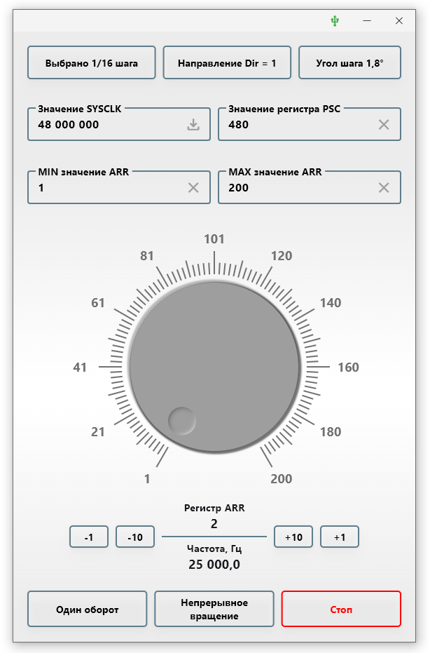

## stepper_motor_test

#### Программа для тестирования шагового двигателя

    

  

#### Описание
Приложение для операционной системы Windows.

Код для микроконтроллера STM32F103 расположен по адресу:  

https://github.com/sergeyerofeev/Projects_on_STM32F103/tree/main/stepper_motor_test  

Частота ШИМ выходного сигнала, которая подаётся на вход DIR драйвера A4988, рассчитывается исходя 
из переданного значения SYSCLK, предделителя PSC и установленного значения ARR.  

Значение тактовой частоты SYSCLK можно установить вручную, либо получить текущее, нажав на кнопку 
загрузки в поле ввода.  

Для выбора доступны следующие значения:
- микрошаг: Полный шаг, 1/2, 1/4, 1/8, 1/16  
- угол шага (количество шагов): 0,9&deg; (400), 1,8&deg; (200), 3,6&deg; (100), 5,625&deg; (64), 7,5&deg; (48)  

При закрытии приложения на микроконтроллер отправляется команда на остановку двигателя, сохраняются 
все введённые/выбранные значения. При следующем запуске текущие значения будут восстановлены. 

